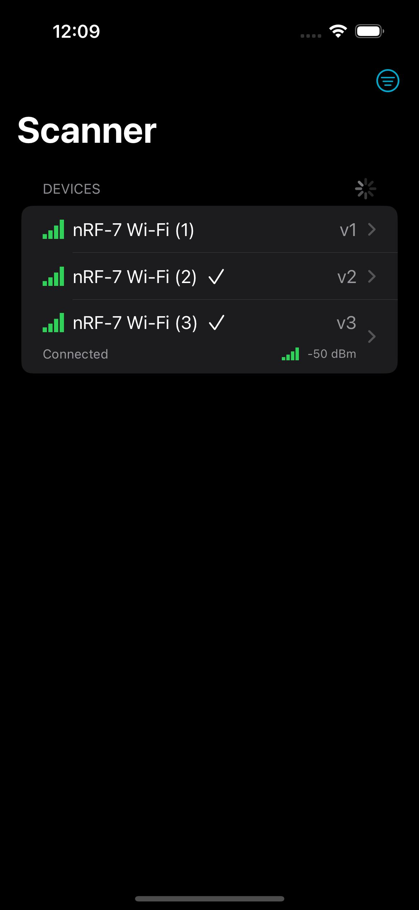
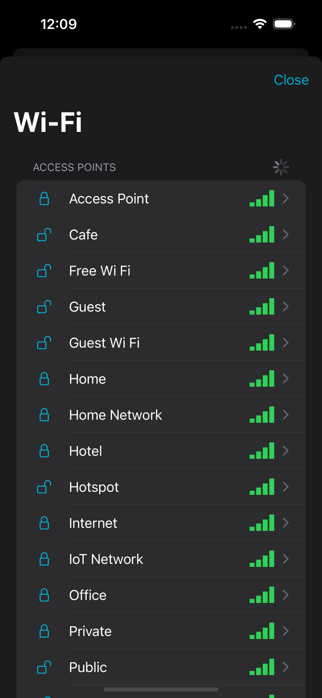
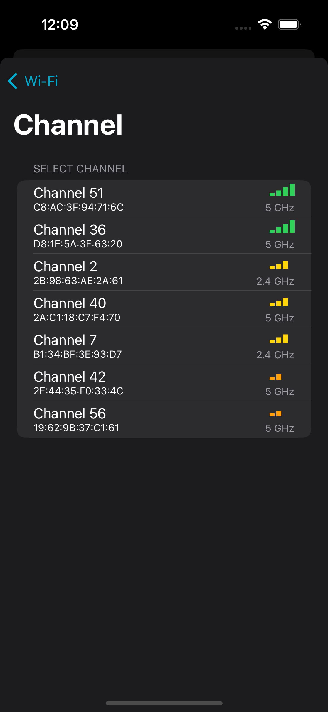
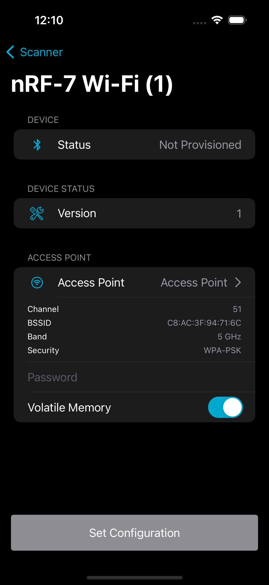

# NordicWiFiProvisioner library
`NordicWiFiProvisioner` is a library that allows to communicate with [nRF 7 devices](https://www.nordicsemi.com/Products/nRF7002).
You can use it to connect to a device, read the information from it, and set the Wi-Fi configuration.

## Installation

Currently, the Provisioner library has been split into two independent variants. It's possible to import and use both within the same project / app, as exemplified by our own 'Example' app. The reason for the split is to not force customers of our API to deal with APIs and callbacks they don't wish to know about. But we have under heavy consideration the urge to merge them.

* **`NordicWiFiProvisioner-BLE`**: Scans for devices via Bluetooth LE, connect to a device, & provision it.
* **`NordicWiFiProvisioner-SoftAP`**: Scans for devices via Wi-Fi, connects to the target device, and makes a URL Request with the provisioning details. **Requires IP Address of the target device.** Our Example app includes a lot of resources & code to help in your endeavor.

The library can be installed via [Swift Package Manager](https://swift.org/package-manager/) or [CocoaPods](https://cocoapods.org/).

### Swift Package Manager

The library can also be included as SPM package. Simply add it in Xcode: File -> Swift Packages -> Add package dependency, type https://github.com/NordicSemiconductor/IOS-nRF-Wi-Fi-Provisioner.git and set required version, branch or commit.

If you have Swift.package file, include the following dependency:

```swift
dependencies: [
    // [...]
    .package(name: "NordicWiFiProvisioner-BLE", 
             url: "https://github.com/NordicSemiconductor/IOS-nRF-Wi-Fi-Provisioner.git", 
             .upToNextMajor(from: "x.y"))
    .package(name: "NordicWiFiProvisioner-SoftAP", 
             url: "https://github.com/NordicSemiconductor/IOS-nRF-Wi-Fi-Provisioner.git", 
             .upToNextMajor(from: "x.y"))
]
```

### CocoaPods
You can install the library using [CocoaPods](https://cocoapods.org/). Add the following line to your `Podfile`:

```ruby
pod 'NordicWiFiProvisioner-BLE'
pod 'NordicWiFiProvisioner-SoftAP'
```

and run `pod install` in the directory containing your `Podfile`.

## Usage

Check out the [DOCUMENTATION](https://nordicsemiconductor.github.io/IOS-nRF-Wi-Fi-Provisioner/documentation/nordicwifiprovisioner/) for more details.

### Provisioning over Bluetooth LE (**NordicWiFiProvisioner-BLE**)

#### Scanning for devices

The library provides `Scanner` that allows to scan for nRF-7 Devices. If filters discovered devices by service UUID and returns only devices that have the wifi service, so you can use it to scan for devices that support Wi-Fi provisioning and don't warry about filtering them.

```swift
self.scanner = Scanner()
self.scanner.delegate = scannerDelegate

class ScannerDelegate {
    func scannerDidUpdateState(_ state: Scanner.State) {
        // Handle state change
    }
    
    func scannerStartedScanning() {
        // Handle start scanning
    }
    
    func scannerStoppedScanning() {
        // Handle stop scanning
    }
}
```

### Connecting to a device

To connect to a device, you need to create a `DeviceManager` and call `connect` method.

```swift
deviceManager = DeviceManager(scanResult: scanResult)
deviceManager.connectionDelegate = connectionDelegate
deviceManager.connect()

class MyConnectionDelegate: ConnectionDelegate {
    func deviceManagerConnectedDevice(_ deviceManager: DeviceManager) {
        // Handle connected device
    }
    
    func deviceManagerDidFailToConnect(_ deviceManager: DeviceManager, error: Error) {
        // Handle failed to connect
    }
    
    func deviceManagerDisconnectedDevice(_ deviceManager: DeviceManager, error: Error?) {
        // Handle disconnected device
    }
    
    func deviceManager(_ deviceManager: DeviceManager, changedConnectionState newState: DeviceManager.ConnectionState) {
        // Handle connection state change
    }
 }
 ```

### Reading device information
To read device information, you need to call `readVersion` and `readDeviceStatus` methods.

```swift
// Set delegate
deviceManager.infoDelegate = infoDelegate

// Read device information
try deviceManager.readVersion()
try deviceManager.readDeviceStatus()

class MyInfoDelegate: InfoDelegate {
    func versionReceived(_ version: Result<Int, NordicWiFiProvisioner.ProvisionerInfoError>) {
        // Handle version
    }
    
    func deviceStatusReceived(_ status: Result<NordicWiFiProvisioner.DeviceStatus, NordicWiFiProvisioner.ProvisionerError>) {
        // Handle device status
    }
}
```

### Scan for Wi-Fi networks
You can ask the device to scan for nearby Wi-Fi networks. The device will scan for networks and return the list of them. 

```swift
// Set delegate
deviceManager.wiFiScanerDelegate = wifiScanDelegate

// Start / Stop scanning
try deviceManager.startScan()
try deviceManager.stopScan()

class MyWiFiScannerDelegate: WiFiScanerDelegate {
    func deviceManager(_ deviceManager: DeviceManager, discoveredAccessPoint wifi: WifiInfo, rssi: Int?) {
        // Handle new Wi-Fi network
    }
    
    func deviceManagerDidStartScan(_ deviceManager: DeviceManager, error: Error?) {
        // Handle start scanning
    }
    
    func deviceManagerDidStopScan(_ deviceManager: DeviceManager, error: Error?) {
        // Handle stop scanning
    }
 }
```

### Set Wi-Fi configuration
To set Wi-Fi configuration, you need to call `setWiFiConfiguration` method.

```swift
// Set delegate
deviceManager.provisionerDelegate = provisionerDelegate

// Set configuration
try deviceManager.setConfig(wifi: wifi, passphrase: "WiFiPassword", volatileMemory: false)

// Forget configuration
try deviceManager.forgetConfig()

class MyProvisionDelegate: ProvisionDelegate {
    func deviceManagerDidSetConfig(_ deviceManager: DeviceManager, error: Error?) {
        // New configuration was set
    }
    
    func deviceManager(_ deviceManager: NordicWiFiProvisioner.DeviceManager, didChangeState state: NordicWiFiProvisioner.ConnectionState) {
        // Connection Status changed
    }
    
    func deviceManagerDidForgetConfig(_ deviceManager: NordicWiFiProvisioner.DeviceManager, error: Error?) {
        // Configuration was removed
    }
 }
```

### Provisioning over Wi-Fi (**NordicWiFiProvisioner-SoftAP**)

```swift
// SSL Requirement
let cert: URL = // Certificate URL 
let manager = ProvisionManager(certificateURL: cert)

// Scan Wi-Fi Networks you'd like to provision the device to.
let scans = try await manager.getScans(ipAddress: ipAddress)
let selectedScan = scans.filter { 
    // Logic to choose which Wi-Fi Network we'd like to provision our device to.
}

let targetDeviceIPAddress: String = // ...
let networkPassword: String = // ...

// Provision
try await manager.provision(ipAddress: targetDeviceIPAddress, to: selectedScan, with: networkPassword)

```

# Services and Characteristics

## [Bluetooth LE Service](https://nickkibish.github.io/IOS-nRF-Wi-Fi-Provisioner/documentation/nordicwifiprovisioner/serviceid)
Application depends on one service which should be implemented by an IoT device:
```14387800-130c-49e7-b877-2881c89cb258```

## [Characteristics](https://nickkibish.github.io/IOS-nRF-Wi-Fi-Provisioner/documentation/nordicwifiprovisioner/characteristicid)
The service contains 3 characteristics.
1. ```14387801-130c-49e7-b877-2881c89cb258``` - Unprotected version characteristic which return version number. It is reserved for checking supporting version before actual start of work. 
2. ```14387802-130c-49e7-b877-2881c89cb258``` - Protected with pairing control-point characteristic. It is used by the phone to send commands. In indication the command result status is obtained in asynchronous manner.
3. ```14387803-130c-49e7-b877-2881c89cb258``` - Protected with pairing data-out characteristic. In notification the IoT device sends available Wi-Fi items and connectivity status updates.

## Proto files
The communication with the IoT device is handled with the usage of [Proto files](Sources/NordicWiFiProvisioner/proto/proto/).


# Application

<a href='https://apps.apple.com/app/nrf-wi-fi-provisioner/id1638948698'></a>

 |  |  |  
--- | --- | --- | ---
1 | 2 | 3 | 4 

## Flow
The application allows to communicate with a nRF 7 series device.
The main job of the phone is to get status from the device and initiate provisioning or unprovisioning process.

### Obtaining status

1. The phone connects to the selected IoT device and initialise pairing.
2. After successful pairing it downloads current version and status.
3. Based on status - provisioning or unprovisioning process can be initiated. 

### Provisioning
1. The phone send START_SCAN command to the IoT device and waits for the result.
2. The phone displays the list with result. An user can select Wi-Fi. If Wi-Fi item provides such an option, then there is a possibility to select a specific channel to connect.
3. After selecting interesting Wi-Fi the phone should send STOP_SCAN command.
4. The user needs to provide a password if the selected Wi-Fi is protected.
5. The user selects if the Wi-Fi should be stored in persistent memory which means that Wi-Fi credentials should survive restarting process.
6. Then the user clicks "Set Configuration" button which sends credential to the IoT device and receive connectivity changes from it.
7. When the IoT device is provisioned then the process is finished and a next device can be provisioned.

### Unprovisioning
1. The phone sends FORGET_CONFIG command and receive success/error result.
